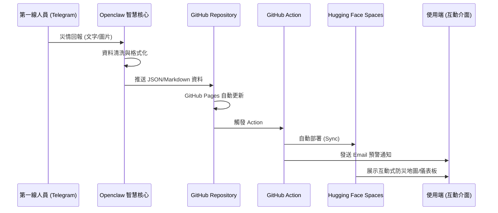

# 從自動生成程式碼到無縫部署：運用 Antigravity 與 Openclaw 打造即時防災資訊系統

## 專案情境 (Scenario)
假定一個情境，在發生颱風或有暴雨的時候，各地方產生的災情有時無法立刻即時掌握，需要派出第一線人員巡查災情，才能掌握。在第一線通報需求量大的情況下為了讓災情掌握更即時且有效率，自動化的資訊整合流程十分重要。

整個通報過程包含：
1. **第一線人員回報**：透過行動裝置快速通報現場狀況。
2. **後端自動化分析**：系統自動整理分析回報訊息。
3. **即時展示與通知**：將訊息展示於網頁儀表板，並自動透過 Email、Line 等方式通知相關單位。

## 系統核心功能
- **Rapid Reporting**: 專為極端天氣環境設計的簡捷回報介面。
- **Auto-Integration**: 使用 Openclaw 智慧核心自動媒合通報情資。
- **Live Dashboard**: 視覺化展示災情分布與處理進度。
- **Omni-Notification**: 自動化多管道預警通知系統。

[自然語言需求]
      ↓
Antigravity（自動生成程式碼）
      ↓
第一線人員 (Telegram 通報)
      ↓
Openclaw（處理與格式化）
      ↓
GitHub Repository (資料中心)
      ↓
  ├── GitHub Pages (靜態網頁)
  └── GitHub Action (自動部署)
            ↓
      Hugging Face Spaces (互動式網頁)


## 系統架構圖

```mermaid
graph TD
    A[第一線人員 (Telegram)] -->|災情通報| B[Openclaw 智慧核心]
    B -->|格式化並推送| C[GitHub Repository]
    C -->|靜態網頁展示| D[GitHub Pages]
    C -->|GitHub Action 自動流程| G[自動發送 Email]
    G --> F[防災相關人員]
    C -->|GitHub Action 自動部署| E[Hugging Face Spaces]
    E --> F
    
    subgraph "通報與處理"
        A
        B
    end
    
    subgraph "存儲與自動化"
        C
        G
    end
    
    subgraph "展示與通知終端"
        D
        E
        F
    end
```

## 系統流程圖

